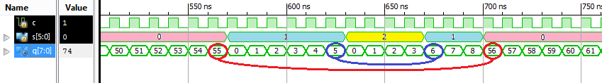

# Spartan-6: 8-битный 64-слойный счётчик

Проект демонстрирует возможность создания "многослойных" схем (с быстрым переключения контекста) путём замены FF (flip-flops) на синхронное ОЗУ RAM64x1S. Это позволяет без задержек переключать контексты (состояния).

Симуляция последовательно заставляет работать счётчик в контекстах №№ 0, 1, 2, 1, 0 путём подачи соотв. значения на шину s[5:0]. На выходе счётчика q[7:0] видно, что счётчик продолжает считать в текущем контексте с того момента, с которого которого он был переключен на другой контекст.

"Многослойный" триггер описан в [t64.v](t64.v#L31) как 64-битный регистр mem[63:0], который на этапе синтеза преобразуется в примитив RAM64x1S.

Подробное [описание](https://habr.com/ru/post/648799/) метода.
